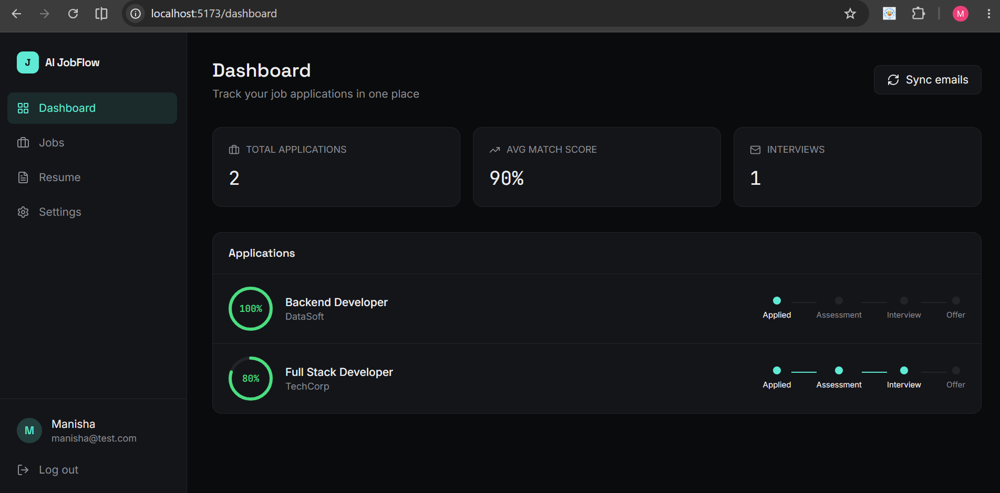
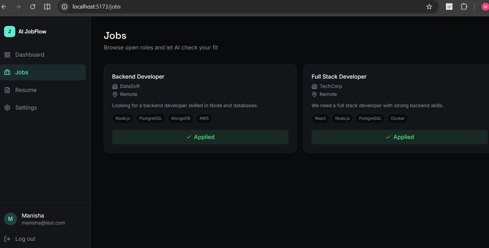
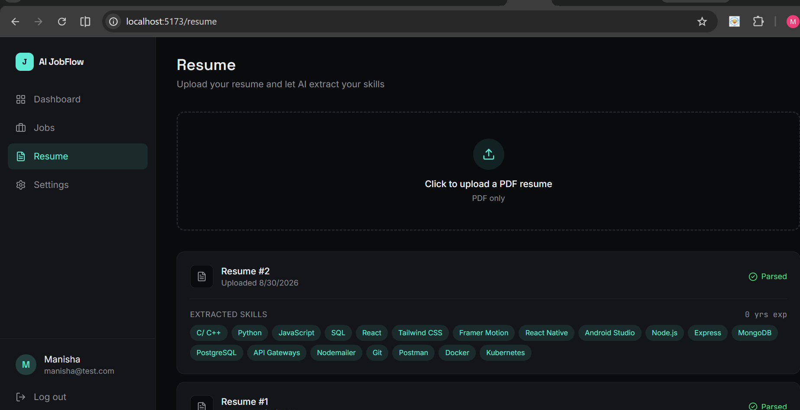
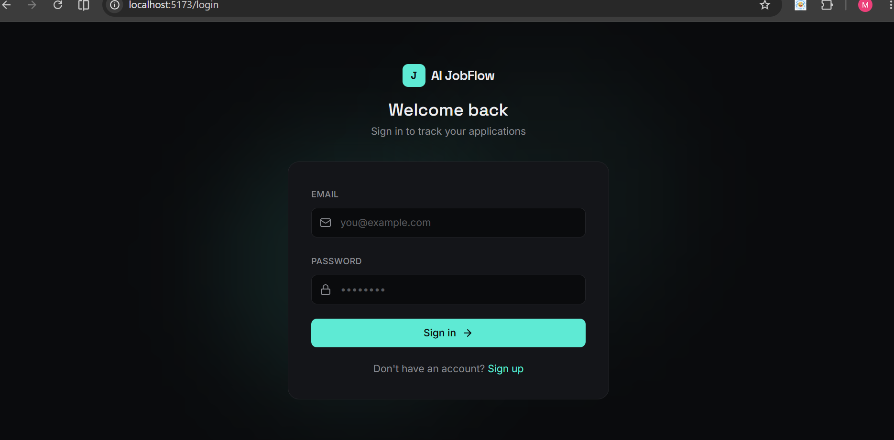

# AI JobFlow

An AI-powered job application tracker that parses resumes, matches them against job descriptions, and automatically updates application status by reading your Gmail inbox.

## Features

- **AI Resume Parser** — Upload a PDF resume; Gemini AI extracts skills and years of experience automatically.
- **AI Resume-JD Matching** — Get an instant match score, matched/missing skills, and improvement suggestions when applying to a job.
- **Gmail Automation** — Connect your inbox via OAuth2; AI classifies incoming emails (interview / rejected / assessment / offer) and updates your application status automatically.
- **JWT Authentication** — Secure signup/login with hashed passwords.
- **Cloud Resume Storage** — Resumes stored on Cloudinary, not the database.

## Tech Stack

**Backend:** Node.js, Express, PostgreSQL, Prisma ORM, Google Gemini API, Gmail API (OAuth2), JWT, Cloudinary, Multer

**Frontend:** React, Vite, Tailwind CSS, Zustand, Axios, React Router, Lucide Icons

## Architecture

**User** uploads a resume → **Gemini AI** extracts skills → user applies to a **Job** → **AI Matching Engine** returns a match score and missing skills → an **Application** is created → **Gmail Sync** reads incoming emails → **AI Email Classifier** detects interview/rejection/offer → **Application status** updates automatically.


## Database Schema

Relational design in PostgreSQL with the following core models: `User`, `Resume`, `Job`, `Application`, `Interview`, `Email` — connected via foreign keys (a User has many Resumes and Applications; an Application links a User, Job, and Resume).

## Getting Started

### Backend

```bash
cd backend
npm install
```

Create a `.env` file:

DATABASE_URL=your_postgresql_connection_string
JWT_SECRET=your_jwt_secret
PORT=5000
CLOUDINARY_CLOUD_NAME=your_cloud_name
CLOUDINARY_API_KEY=your_api_key
CLOUDINARY_API_SECRET=your_api_secret
GEMINI_API_KEY=your_gemini_key
GMAIL_CLIENT_ID=your_gmail_client_id
GMAIL_CLIENT_SECRET=your_gmail_client_secret
GMAIL_REDIRECT_URI=http://localhost:5000/api/gmail/callback


```bash
npx prisma migrate dev
npm run dev
```

### Frontend

```bash
cd frontend
npm install
npm run dev
```

## Screenshots

### Dashboard


### Jobs Page


### Resume Page


### Login
_

